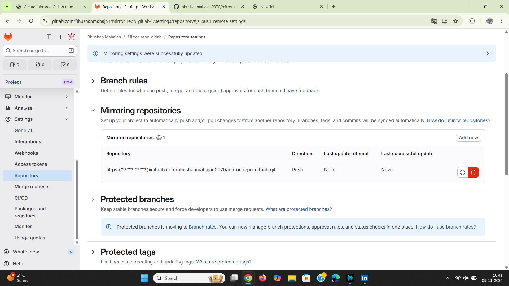
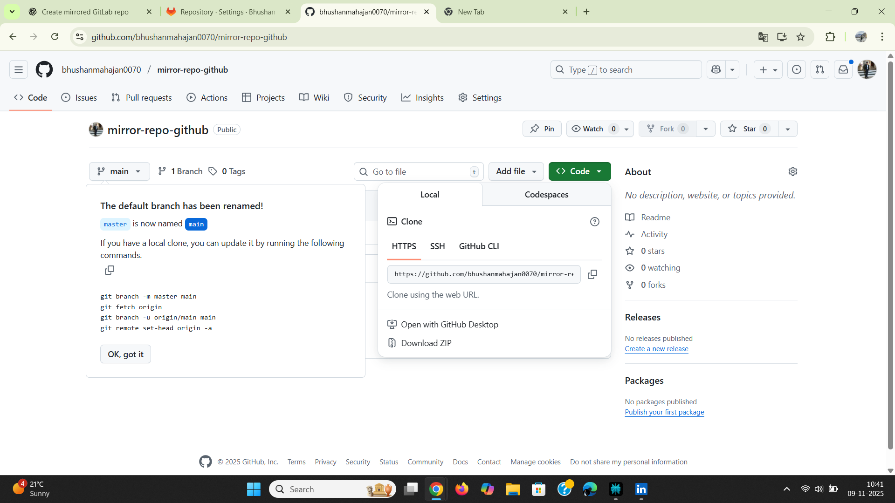
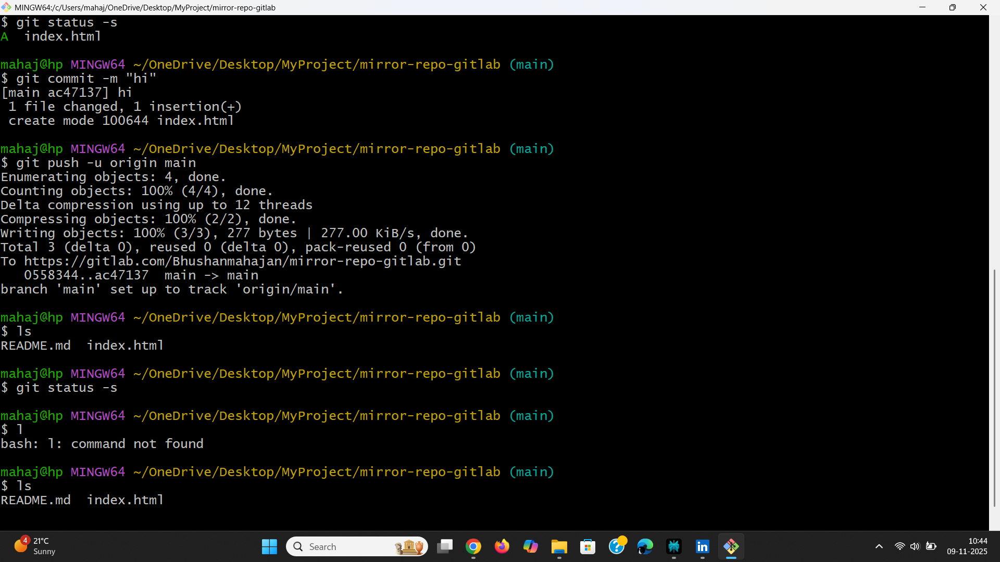

# 🪞 GitLab ↔ GitHub Repository Mirroring

This project demonstrates how to **create a mirrored repository between GitLab and GitHub** — allowing automatic synchronization between the two platforms.  

---

## 📘 Project Overview

- **Source Repo (GitLab):** `Mirror-repo-gitlab`
- **Destination Repo (GitHub):** `mirror-repo-github`
- **Direction:** Push Mirror (GitLab → GitHub)
- **Author:** [Bhushan Mahajan](https://gitlab.com/Bhushanmahajan)

---

## ⚙️ Step-by-Step Setup Guide

### 🧩 Step 1 — Create a New Blank Project on GitLab
1. Navigate to **Projects → New Project → Create Blank Project**
2. Enter project name → `Mirror-repo-gitlab`
3. Set visibility → **Public**
4. Click **Create Project**

📸 **Screenshot:**  


---

### 🧩 Step 2 — Create a New Repository on GitHub
1. Go to your GitHub profile → **New Repository**
2. Set repository name → `mirror-repo-github`
3. Set visibility → **Public**
4. Optionally add a README
5. Click **Create Repository**

📸 **Screenshot:**  


---

### 🧩 Step 3 — Configure GitLab Repository Mirroring
1. Open **Settings → Repository → Mirroring Repositories**
2. Click **Add New**
3. Paste your **GitHub repo URL** (e.g., `https://github.com/bhushanmahajan0070/mirror-repo-github.git`)
4. Select **Push direction**
5. Choose **Authentication method → Password / Token**
6. Enter your **GitHub Personal Access Token**
7. Click **Mirror Repository**

📸 **Screenshot:**  


---

### 🧩 Step 4 — Copy GitHub HTTPS URL
From your GitHub repository:
- Click the **Code** button → Copy the HTTPS URL

📸 **Screenshot:**  


---

### 🧩 Step 5 — Add and Push Files from Local Machine
Initialize files locally and push to GitLab:

```bash
git status -s
git add .
git commit -m "hi"
git push -u origin main

---

## 🧩 Final Verification (3 Steps)

### 🧩 Step 6 — Push Code from Local Machine (verification)
Push output confirming the push to GitLab.

📸 **Screenshot:**  


**Commands used:**
```bash
git status -s
git add .
git commit -m "hi"
git push -u origin main
